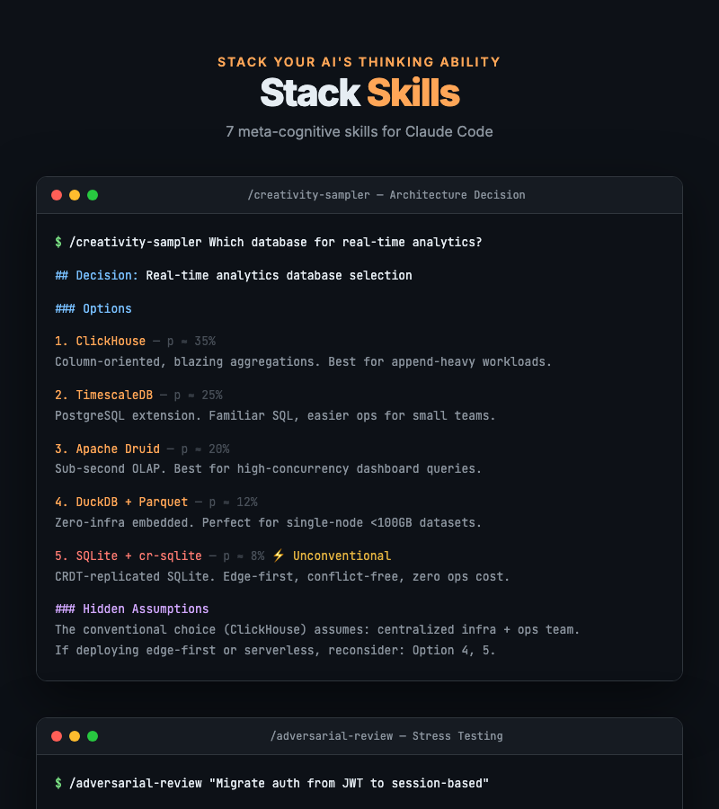

# Stack Skills

**Stack your AI's thinking ability.**

7 meta-cognitive skills that upgrade how your AI *thinks* — not just what it codes. Research deeper, decide smarter, review harder, learn faster.

> Built for [Claude Code](https://claude.com/claude-code) | Compatible with [Agent Skills](https://agentskills.io) open standard
> Created by [@thestack_ai](https://github.com/whynowlab)

<p align="center">
  
</p>

---

## Why Stack Skills?

Most AI coding skills help you write code faster. **Stack Skills help you think better.**

| What others do | What Stack Skills do |
|:---|:---|
| "Generate boilerplate" | "Cross-verify this claim across 3+ sources" |
| "Fix this lint error" | "Find the 3 strongest arguments against this architecture" |
| "Write unit tests" | "Generate 9 tiered questions to verify my understanding" |
| "Format this code" | "Give me 5 options, including ones you'd normally suppress" |

These aren't coding shortcuts. They're **thinking upgrades.**

---

## Skills

### Research & Decision

| Skill | What it does | Trigger |
|:------|:-------------|:--------|
| **cross-verified-research** | 4-stage verified research pipeline with source tiering (S/A/B/C) and anti-hallucination gate | `"research"` `"investigate"` `"fact-check"` |
| **creativity-sampler** | Generates exactly 5 probability-weighted options, forcing at least 1 unconventional alternative | `"alternatives"` `"options"` `"ideas"` |
| **adversarial-review** | 3-vector Devil's Advocate attack (Logical + Edge Case + Microscopic) with severity grading | `"stress test"` `"devil's advocate"` `"is this okay?"` |

### Workflow & Architecture

| Skill | What it does | Trigger |
|:------|:-------------|:--------|
| **skill-composer** | Chains multiple skills into pipelines (Sequential / Fork-Join / Iterative) | `"workflow"` `"pipeline"` `"combine skills"` |
| **persona-architect** | Designs 5-layer AI persona DNA (Identity / Communication / Behavior / Expertise / Boundaries) | `"persona"` `"voice"` `"tone"` |

### Analysis & Testing

| Skill | What it does | Trigger |
|:------|:-------------|:--------|
| **deep-dive-analyzer** | Microscopic deconstruction in 3 modes: Code / System / Concept (5-Part Codex) | `"deep dive"` `"analyze"` `"deconstruct"` |
| **tiered-test-generator** | 3-tier knowledge verification (Conceptual / Applied / Expert) with grading and diagnostics | `"quiz"` `"knowledge check"` `"challenge me"` |

---

## How They Work Together

```
                        skill-composer
                    (chains everything below)
                             |
         +-------------------+-------------------+
         |                   |                   |
   cross-verified      creativity          persona
     -research          -sampler           -architect
   "verify facts"    "open options"     "set the voice"
         |                   |
         v                   v
    deep-dive          adversarial
    -analyzer            -review
  "understand it"     "break it"
         |
         v
    tiered-test
    -generator
   "prove you know it"
```

### Example Workflow: "Full-Rigor Tech Decision"

```
1. /creativity-sampler "Which database for our real-time analytics?"
   → 5 options with trade-offs (including unconventional ones)

2. /cross-verified-research "Compare ClickHouse vs TimescaleDB for 100K events/sec"
   → Cross-verified analysis with source tiers

3. /adversarial-review "We chose ClickHouse — stress test this decision"
   → 3-vector attack exposing hidden assumptions

4. /deep-dive-analyzer "ClickHouse MergeTree engine internals"
   → Microscopic deconstruction of the chosen technology

5. /tiered-test-generator "ClickHouse architecture and query optimization"
   → 9 questions to verify team understanding before implementation
```

---

## Benchmark: Baseline vs Stack Skills

Same tasks, same AI model. Only difference: Stack Skills methodology applied.

### Results

| Scenario | Baseline | Stack Skills | Improvement |
|:---------|:--------:|:-----------:|:-----------:|
| Research: "Is SQLite viable for 1000 concurrent users?" | 5/10 | 9/10 | **+80%** |
| Decision: "Which state management for React e-commerce?" | 5/10 | 9/10 | **+80%** |
| Review: "Single PostgreSQL for OLTP + analytics?" | 4/10 | 8/10 | **+100%** |
| **Average** | **4.7** | **8.7** | **+85%** |

### What changed?

| Dimension | Without Stack Skills | With Stack Skills |
|:----------|:---------------------|:------------------|
| Sources cited | 0 | 10 (including Tier S academic/official) |
| Options explored | 1-3 (safe defaults) | 5 (including unconventional alternatives) |
| Issues found | 4 (surface-level) | 12 (4 Critical severity) |
| Hidden assumptions exposed | 0 | 5+ |
| Actionability | "Use X" | SQL configs, timelines, trade-offs |

### Key findings

- **Research**: Baseline said "use PostgreSQL." Stack Skills discovered that 1000 concurrent users = ~30 concurrent writes = **120x headroom for SQLite**. Completely different conclusion.
- **Decision**: Baseline said "use Zustand." Stack Skills discovered that **where you store the cart (server vs client) matters more than which library you pick**.
- **Review**: Baseline listed 4 general concerns. Stack Skills found a **Critical security issue** (multi-tenant data leakage via analytics queries) and provided the RLS fix with SQL.

> Baseline gives you **an answer**. Stack Skills helps you **find better questions**.

---

## Install

### Quick Install (npx)

```bash
npx skills add whynowlab/stack-skills --all
```

### Plugin Marketplace

```bash
/plugin marketplace add whynowlab/stack-skills
/plugin install stack-skills@whynowlab/stack-skills
```

### Manual

```bash
git clone https://github.com/whynowlab/stack-skills.git
cp -r stack-skills/skills/* ~/.claude/skills/
```

### Per-Project

```bash
# Add to your project's .claude/skills/ directory
cp -r stack-skills/skills/cross-verified-research .claude/skills/
```

---

## Compatibility

| Platform | Status |
|:---------|:-------|
| Claude Code | Fully supported |
| Cursor | Compatible (Agent Skills standard) |
| GitHub Copilot | Compatible (Agent Skills standard) |
| Codex CLI | Compatible (Agent Skills standard) |

---

## License

MIT License. See [LICENSE](LICENSE).

---

**Stack Skills** by [@thestack_ai](https://github.com/whynowlab) — Stack your AI's thinking ability.
